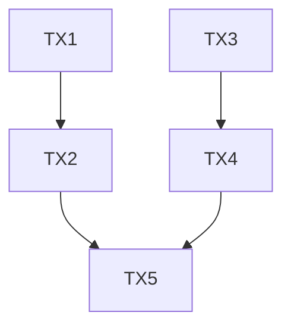

The Metis Parallel Execution Framework (MPEF) is a next-generation transaction execution engine that powers Metis Hyperion (HYPE) with unprecedented throughput and efficiency. This guide provides developers with a comprehensive understanding of MPEF and how to optimize smart contracts to leverage its parallel execution capabilities.

## Introduction

Traditional blockchain execution engines process transactions sequentially, resulting in bottlenecks as network usage increases. MPEF eliminates this limitation by enabling concurrent transaction processing while maintaining data consistency and transaction integrity.

By combining advanced techniques like Block-STM, static dependency analysis, and DAG-based scheduling, MPEF achieves dramatic performance improvements without sacrificing security or determinism.

## Key Concepts

### Transaction Dependencies

For parallel execution to work correctly, the system needs to understand when transactions can safely execute concurrently:

- **Independent transactions**: Operations that don't access the same state can run in parallel
- **Dependent transactions**: Operations with overlapping state access must maintain execution order
- **Conflict detection**: The system identifies and manages potential conflicts to ensure consistent results

### DAG-Based Execution Model

MPEF uses a Directed Acyclic Graph (DAG) to represent transaction dependencies:



In this example:

- TX1 and TX3 can execute in parallel (independent)
- TX2 depends on TX1 and TX4 depends on TX3
- TX5 depends on both TX2 and TX4

### Optimistic Concurrency Control (OCC)

MPEF employs OCC to maximize throughput:

1. Transactions execute speculatively without waiting for dependency resolution
2. The system tracks read and write sets during execution
3. If conflicts are detected, affected transactions are rolled back and re-executed
4. Successful transactions are committed to the final state

## Architecture Components

### 1. Transaction Pre-Processing

Before execution, MPEF analyzes transactions to optimize parallel processing.

The static analyzer identifies:

- Storage slots accessed (e.g., `balances[msg.sender]`, `balances[to]`)
- Access patterns (read/write)
- Potential conflicts between transactions

#### Dependency Graph Generation

MPEF constructs a DAG representing transaction dependencies:

- Nodes represent transactions
- Edges represent dependencies (must execute in order)
- Independent paths represent opportunities for parallelization

#### Batch Formation

Transactions are grouped into execution batches based on the DAG:

- Layer 1: All independent transactions
- Layer 2: Transactions depending only on Layer 1
- And so on...

### 2. Parallel Execution Engine

The core of MPEF is its parallel execution engine:

#### Optimistic Concurrency Control

```
Process:
1. Begin transaction
2. Execute speculatively
3. Track read/write set
4. Validate (check conflicts)
5. If valid, commit; otherwise, abort and retry
```

This approach allows maximum throughput while ensuring correct execution results.

#### DAG-Based Scheduling

The scheduler:

- Executes independent transactions concurrently
- Respects DAG dependencies for ordering
- Dynamically adjusts priorities based on gas fees, user specifications, etc.

### 3. State Management

Efficient state management is crucial for parallel execution:

#### Multi-Version Concurrency Control (MVCC)

MPEF maintains multiple versions of the blockchain state:

- Each transaction sees a consistent snapshot
- New versions are created during execution
- Versions are merged or discarded based on validation results

#### Asynchronous State Updates

State changes are committed efficiently:

- Updates are batched for performance
- Commits happen after validation
- MetisDB integration ensures efficient storage and retrieval

### 4. Validation and Feedback

MPEF provides real-time validation and feedback:

- **Conflict Detection**: Continuously monitors for state access conflicts
- **Execution Status**: Provides immediate feedback on transaction status
- **Performance Metrics**: Tracks execution statistics for optimization

## Execution Workflow Example

To illustrate the complete workflow, let's follow a set of transactions through MPEF:

1. Users submit multiple token transfer transactions to Metis Hyperion
2. Transactions enter the mempool and are forwarded to MPEF
3. Static analysis identifies which transfers can run in parallel (different sender/recipient pairs)
4. DAG generation creates a dependency graph, grouping independent transfers
5. Parallel execution processes multiple transfers simultaneously
6. MVCC maintains consistent state during execution
7. Conflict detection identifies any overlapping state access
8. Validation confirms transaction results
9. State updates are committed to MetisDB
10. Users receive confirmation with minimal latency

## Performance Benefits

MPEF provides significant performance improvements:

| Scenario                     | Without MPEF | With MPEF  |
| ---------------------------- | ------------ | ---------- |
| Independent ERC-20 Transfers | 100-200 TPS  | 1,000+ TPS |
| DEX Swaps (Different Pairs)  | 50-100 TPS   | 500+ TPS   |
| NFT Minting                  | 30-60 TPS    | 300+ TPS   |
| Complex DeFi Operations      | 20-40 TPS    | 100+ TPS   |

## Conclusion

The Metis Parallel Execution Framework represents a paradigm shift in blockchain transaction processing. By leveraging cutting-edge parallel execution techniques, MPEF enables unprecedented throughput without compromising security or consistency.

Developers who design their smart contracts with parallelization in mind can achieve dramatic performance improvements, creating responsive dApps that deliver Web2-like user experiences within a decentralized blockchain environment.
