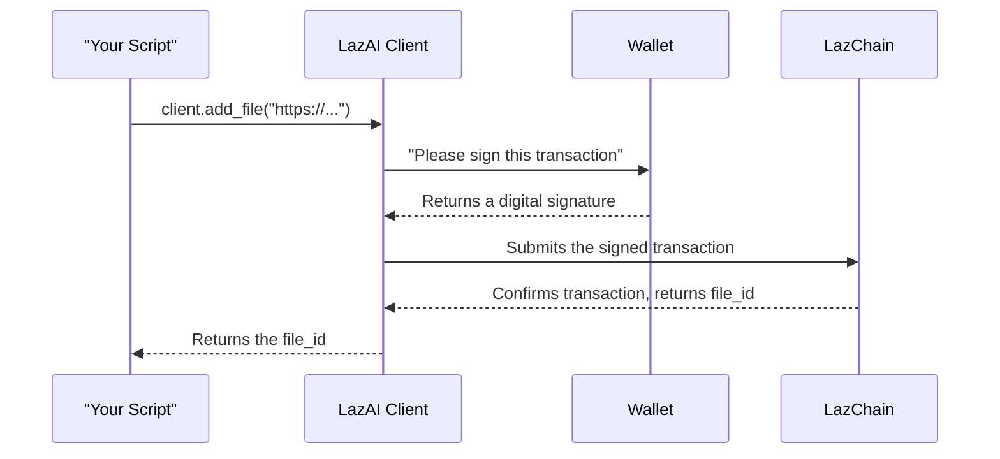

What if we want to connect it to a larger, global network? How can we share data, offer services, or use services from other AI agents around the world in a secure and verifiable way?

This is where the LazAI network comes in, and your gateway to it is the LazAI Client.

## Your Passport to a Decentralized AI Nation

Imagine the LazAI network is a new digital country. This country has its own government (a blockchain), public records office, and a marketplace for AI services. To do anything in this country—like register property, open a business, or hire someone—you need a passport and a way to interact with its systems.

The `alith.lazai.Client` is your personal passport and remote control for the LazAI network.

You use it to:

- **Establish Your Identity:** It manages your digital wallet, which is your unique ID on the network.
- **Interact with the "Government":** It lets you perform official actions on the blockchain, like registering data or services.
- **Participate in the Economy:** It allows you to request services from other network members and handle payments.

Our goal is simple but fundamental: we'll use the `LazAI Client` to perform our first official act on the network: **registering a piece of data (a file's location) in the public record.**

## Getting Your Passport: Creating a Client

The first step to entering any new country is to get your passport. With Alith, this is incredibly easy.

**1. Import and Create the Client**

```python
from alith.lazai import Client

# This one line connects you to the LazAI network
client = Client()
```

That's it! When you create an instance of `Client`, Alith automatically creates a new digital wallet for you (or loads an existing one). This wallet is your identity. You can think of it as your unique passport number.

**2. See Your New Identity**

Every passport has a unique number. You can see your wallet's public address like this:

```python
print("My wallet address:", client.wallet.address)
```

**Example Output:**

```
My wallet address: 0xAbC123...dE45F6
```

This address is your public identity on the LazAI network. You'll use it to sign transactions and prove ownership.

## Your First Official Act: Registering a File

Now that we have our passport, let's interact with the "public records office" (the blockchain). We're going to register the location of a file. This doesn't upload the file itself; it just creates a permanent, verifiable record on the blockchain that says, "This file, at this URL, is associated with me."

**1. Define the File's Location**

First, let's specify the URL of the file we want to register.

```python
# The location of the data we want to register
url = "https://example.com/my-awesome-dataset.csv"
```

**2. Add the File to the LazAI Registry**

Next, we use our `client` to call the `add_file` function. This is like going to the records office and officially filing paperwork.

```python
# Register the file on the blockchain
file_id = client.add_file(url)

print("My file has been registered with ID:", file_id)
```

The `client.add_file(url)` function sends a request to the LazAI network. The network processes it, adds the record to the blockchain, and gives you back a unique `file_id`. This ID is like your receipt or tracking number.

**3. Verify Your Registration**

How can we be sure our file was actually registered? We can ask the network to look it up for us using its URL.

```python
# Ask the network to find the ID for our URL
retrieved_id = client.get_file_id_by_url(url)

if retrieved_id == file_id:
    print("Success! The network confirms our file is registered.")
```

This confirms that our transaction was successful and the record is now permanently on the blockchain for anyone to see. This simple process is the foundation for data contribution, which is described in detail in the next section.

## How Does It Work Under the Hood?

When you call `client.add_file()`, a few important things happen behind the scenes to ensure the process is secure and verifiable.

1.  **Prepare the "Paperwork":** Your `Client` creates a formal request, called a "transaction," that says "Add this URL to the registry."
2.  **Sign with Your Passport:** The `Client` uses your private wallet key to digitally "sign" this transaction. This is like an official signature that proves the request came from you and nobody else.
3.  **Submit to the Government:** The signed transaction is sent to the LazAI blockchain.
4.  **An Official Record is Made:** The network validators check your signature, confirm the request is valid, and permanently add the information (the URL and your ownership) to the public ledger.
5.  **A Receipt is Issued:** The network assigns a new, unique `file_id` for this record and sends it back to your `Client`.

Here is a diagram showing the flow:



## More Than Just Files: Becoming a Network Participant

The `LazAI Client` is your all-purpose tool for network interaction. Registering a file is just the beginning.

As seen in `lazai_inference_settlement.py`, before you can request paid services, you need to officially register as a "user" and deposit a small amount of funds to cover transaction fees.

```python
# A simplified example of becoming a network user
try:
    # Check if I'm already registered
    client.get_user(client.wallet.address)
except Exception:
    # If not, register and deposit funds for fees
    client.add_user(1000000)
```

This is a one-time setup step, like opening a bank account in our new digital country.

Furthermore, you can use the `Client` to register yourself as a **service provider** (a "node"). As shown in `lazai_add_node.py`, you can tell the network that you are ready to do work for others.

```python
# A simplified example of registering your own service
my_service_url = "https://my-ai-service.com"
my_public_key = "-----BEGIN RSA PUBLIC KEY-----..."

# Announce your service to the network
client.add_node(client.wallet.address, my_service_url, my_public_key)
```

This action tells the LazAI network, "I'm open for business! Anyone who needs my AI service can find me at this address."
