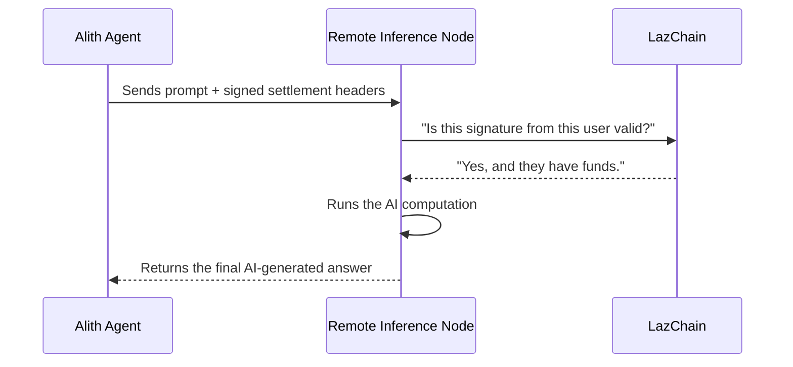

Previously, we got our "passport" to the LazAI network. We learned how to create a digital identity and register a piece of data on the blockchain. We are now official citizens of this new digital country.

But what do we _do_ here? The most exciting part of the LazAI network is its bustling marketplace of AI services. What if your agent needs to think with a super-powerful AI brain that you can't run on your own computer? How do you securely "rent" time on someone else's machine and pay them for it?

## The Pay-As-You-Go AI Marketplace

Imagine you have an AI Agent but you want it to use a massive, cutting-edge AI model. Running this model requires expensive, powerful hardware that you don't have.

In a centralized world, you'd subscribe to a single company's service. In the LazAI network, you can access a global, decentralized marketplace of "inference nodes"—people and organizations all over the world who are renting out their AI processing power.

**Our goal:** We will take a simple `Agent` and make it run its "thinking" process (inference) on a remote machine in the LazAI network. We'll see how payment is handled automatically and securely, without needing to trust the node operator directly.

## The "Digital Check": How Settlement Works

How can a node operator trust that you'll pay them _after_ they've done the work? And how can you be sure you're only paying for the work you requested?

The solution is a "digital check" that you sign _before_ you even send your request. In Alith, these are called **settlement headers**.

When you want to ask a remote AI model a question, here's what happens:

1.  **You Write a Digital Check:** Your `LazAI Client` creates a special set of data (the headers) that says, "I, wallet `0x123...`, promise to pay node `0xABC...` for this one request."
2.  **You Sign It:** You digitally sign this "check" with your wallet's private key. This is a cryptographic guarantee that it came from you.
3.  **You Attach It to Your Request:** Your AI's question and this signed check are sent together to the remote node.
4.  **The Node Verifies the Check:** Before doing any work, the node operator can quickly verify your signature and check the blockchain to see if you have enough funds deposited to cover the cost.
5.  **Work is Done & Payment is Claimed:** Once they see the check is valid, they run the AI model and send you the answer. Later, they can submit your signed "check" to the blockchain to claim their payment.

This creates a fair, trustless, and pay-as-you-go system.

## Using a Remote AI Model: A Step-by-Step Guide

Let's modify our `Agent` to use a remote AI model. We'll be referencing the logic in the [`lazai_inference_settlement.py`](https://github.com/0xLazAI/alith/blob/main/sdks/python/examples/lazai_inference_settlement.py) example file.

**1. One-Time Setup: Join the Club and Add Funds**

Before you can shop in the marketplace, you need to register as a user and deposit a small amount of funds to cover service fees. This is like opening a bank account in the new country.

_This is a one-time operation._ Once you've done it, you're ready to make requests.

```python
from alith.lazai import LazAIClient

# This is the "address" of the service provider group we want to join
LAZAI_IDAO_ADDRESS = "0x34d9E02F9bB4E4C8836e38DF4320D4a79106F194"
client = LazAIClient()

# This block is only run once to set up your account
try:
    client.get_user(client.wallet.address)
    print("User already registered!")
except Exception:
    print("Registering user and depositing funds for services...")
    client.add_user(10000000) # Register on the network
    client.deposit_inference(LAZAI_IDAO_ADDRESS, 5000000) # Deposit funds
```

This code first checks if you're already a registered user. If not, it registers you and deposits some funds into a special account for paying for inference services.

**2. Find a Service Provider (Inference Node)**

Now, let's find a shop to buy from. We'll ask our `client` for the web address (URL) of a registered inference node.

```python
# Get the URL of a node that provides the service
url = client.get_inference_node(LAZAI_IDAO_ADDRESS)[1]

print(f"Found an inference node at: {url}")
```

This fetches a list of available providers from the blockchain and gives us the URL for one of them.

**3. Get Your Signed "Digital Check" (Settlement Headers)**

This is the most important step. We ask our `client` to generate the signed settlement headers for our request.

```python
# Create the signed "digital check" for our request
headers = client.get_request_headers(LAZAI_IDAO_ADDRESS)

print("Generated settlement headers:", headers)
```

**Example Output:**

```
Generated settlement headers: {'X-LazAI-User': '0x...', 'X-LazAI-Node': '0x34d9E...', 'X-LazAI-Nonce': 16, 'X-LazAI-Signature': '0x...'}
```

This dictionary contains your identity (`X-LazAI-User`), the provider's address (`X-LazAI-Node`), a unique number for this request (`X-LazAI-Nonce`), and your unforgeable digital signature (`X-LazAI-Signature`).

**4. Create an Agent Pointing to the Remote Node**

Now, we create our `Agent`, but instead of letting it use a local model, we tell it to send its requests to the remote node's URL and to include our "digital check" with every request.

```python
from alith import Agent

agent = Agent(
    model="Qwen-2.5", # The name of the model on the remote server
    base_url=f"{url}/v1", # The remote server's API address
    extra_headers=headers, # Attach our signed "digital check"
)
```

The `base_url` tells the agent _where_ to send its thoughts, and the `extra_headers` ensures it gets paid for.

**5. Talk to the Remote Agent!**

Now, you can use the agent just like before. But this time, the hard work is being done on a powerful remote machine!

```python
response = agent.prompt("What is Alith?")
print(response)
```

When you run this line, your agent sends the question "What is Alith?" _plus_ your signed settlement headers to the remote node. The node verifies your payment guarantee, runs the `Qwen-2.5` model, and streams the answer back to you.

### How It Works Under the Hood

The process seems simple from your side, but it involves a beautifully coordinated dance between your script, the remote node, and the blockchain.

1.  **You call `agent.prompt()`:** Your script wants an answer.
2.  **Agent Prepares Request:** The `Agent` creates a standard web request for the AI model.
3.  **Client Attaches Headers:** It automatically includes the `extra_headers` you provided.
4.  **Request Sent:** The complete package (prompt + headers) is sent over the internet to the remote inference node.
5.  **Node Verifies Signature:** The _first thing_ the remote node does is check your `X-LazAI-Signature`. It uses a public function to confirm that the request really came from your wallet address and hasn't been tampered with. It also checks the blockchain to ensure you have enough funds deposited.
6.  **Node Does the Work:** If the signature is valid, the node performs the computationally expensive AI inference.
7.  **Response Returned:** The AI's answer is sent back to your `Agent`.
8.  **Settlement Occurs:** The node now holds your signed "check" (the headers) as proof of work. It can submit this proof to the blockchain at any time to have the funds transferred from your deposit to its own account.

Here is a diagram of the flow:



The code in [`lazai_inference_server.py`](https://github.com/0xLazAI/alith/blob/main/sdks/python/examples/lazai_inference_server.py) shows the other side of this transaction. It's a server that listens for requests, and its first step is to check for and validate these exact `X-LazAI-*` headers before it proceeds with any AI computation.
