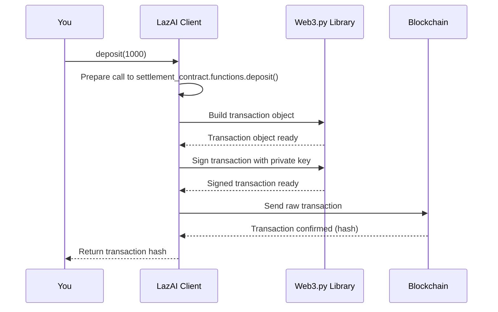

The final step involved a `client` object that handled the actual payment on the blockchain. But what is this mysterious `client`? And how do we, as users, interact with our funds on the LazAI network?

This is where the **LazAI Client** comes in. It is your secure gateway to the LazChain, like a specialized banking app and notary service rolled into one.

### The Problem: Talking to a Blockchain is Hard

Blockchains are powerful, but they aren't user-friendly. Interacting with one directly involves managing cryptographic keys, formatting transactions, calculating "gas" fees (the cost of a transaction), and understanding complex smart contract interfaces. A single mistake could lead to lost funds.

Imagine you want to pay for an AI service. You shouldn't need to be a blockchain expert to do it. You need a simple, safe tool that handles all the technical details for you, just like using a credit card online without needing to understand the international banking system.

### The Solution: Your Personal Blockchain Assistant

The `Client` is our solution. It's a Python class that abstracts away all the low-level blockchain complexity. It provides simple, easy-to-understand methods for all the key actions you might want to perform, such as:

- Checking your account balance.
- Depositing funds to pay for services.
- Registering new compute nodes.
- Signing requests to authorize payment.

It's your secure wallet and remote control for the entire decentralized side of the Alith ecosystem.

### How to Use the LazAI Client

Let's see how to use the `Client` to manage your account. The first step is to initialize it with your `private_key`.

**A quick note on private keys:** A private key is like the master password to your blockchain account. It should be kept extremely secret. We'll load it from an environment variable, which is a secure way to handle secrets in code.

```python
import os
from alith.lazai import Client

# For this example, we'll set a dummy private key.
# In a real app, you would set this in your terminal before running the script:
# export PRIVATE_KEY='0xyour_real_private_key'
os.environ['PRIVATE_KEY'] = '0xac0974bec39a17e36ba4a6b4d238ff944bacb478cbed5efcae784d7bf4f2ff80'

# 1. Create a client instance. It automatically finds your private key.
client = Client()

print(f"Client created for account: {client.wallet.address}")
```

**Output:**

```
Client created for account: 0xf39Fd6e51aad88F6F4ce6aB8827279cffFb92266
```

Great! We've created our `Client` and it's linked to our personal account on the blockchain.

Now, let's perform a simple "read" operation: checking our balance. This just asks the blockchain for information and doesn't cost anything.

```python
# 2. Check the account balance
balance_wei = client.get_balance()

print(f"Current balance is: {balance_wei} wei") # 'wei' is the smallest unit of the currency
```

**Output:**

```
Current balance is: 999999... wei
```

Next, let's perform a "write" operation. We'll deposit some funds into the settlement contract, making them available to pay for AI services. This requires sending a transaction to the blockchain, which the `Client` makes incredibly simple.

```python
# 3. Deposit 1000 wei into the settlement contract for future payments
tx_hash, _ = client.deposit(amount=1000)

print(f"Deposit transaction sent! Transaction hash: {tx_hash.hex()}")
```

**Output:**

```
Deposit transaction sent! Transaction hash: 0x...
```

Behind the scenes, the `Client` created a valid transaction, signed it with your private key, and broadcasted it to the network.

Finally, remember from earlier that paid requests need a signature? The `Client` handles that too. The `get_request_headers` method creates the special headers needed to prove you approve the payment, without sending a full transaction just yet.

```python
# 4. Get authentication headers for a request to a node
node_address = "0x...some_node_address..."
headers = client.get_request_headers(node=node_address)

print("Generated Headers for a Paid Request:")
print(headers)
```

**Output:**

```
Generated Headers for a Paid Request:
{'x-lazai-user': '0xf39...92266', 'x-lazai-nonce': '...', 'x-lazai-signature': '0x...'}
```

You would then include these headers when sending a request to a paid [AI Service Node](05_ai_service_nodes__inference__query__training__.md).

### Under the Hood: How a Transaction is Made

When you call a method like `client.deposit(1000)`, how does the `Client` turn that into a secure blockchain transaction?

1.  **Prepare the Call:** The `Client` identifies which smart contract to talk to (the `settlement_contract`) and which function to call (`deposit`).
2.  **Build the Transaction:** It constructs a transaction object, including the recipient (the contract's address), the value (`1000`), and other details like a `nonce` (a transaction counter to prevent replays).
3.  **Sign:** It uses your secret `private_key` to create a unique digital signature for this exact transaction. This proves to the network that you authorized it.
4.  **Send:** It broadcasts the signed transaction to a blockchain node.
5.  **Confirm:** The node validates the signature and, if valid, includes it in a new block, making the state change (your deposit) permanent. The `Client` then waits for this confirmation.

This flow ensures that only you can authorize actions from your account.



### Diving into the Code

The power of the `Client` comes from two key files: [`alith/lazai/client.py`](https://github.com/0xLazAI/alith/blob/main/sdks/python/alith/lazai/client.py) and [`alith/lazai/chain.py`](https://github.com/0xLazAI/alith/blob/main/sdks/python/alith/lazai/chain.py).

The `Client` class itself is a high-level interface. Its `__init__` method sets up connections to all the important smart contracts on the LazAI network. A contract's `address` is its unique location, and its `ABI` is like a menu of all its available functions.

```python
# Simplified from: alith/lazai/client.py

class Client(ChainManager):
    def __init__(self, private_key: str):
        # The parent ChainManager handles the basic connection and wallet
        super().__init__(private_key=private_key)

        # Connect to the Settlement smart contract using its address and "menu" (ABI)
        self.settlement_contract = self.w3.eth.contract(
            address=contract_config.settlement_address,
            abi=SETTLEMENT_CONTRACT_ABI,
        )
        # ... and connections to all other contracts ...
```

This setup means `self.settlement_contract` is now a ready-to-use Python object that represents the smart contract on the blockchain.

When you call a method like `deposit`, it's a simple wrapper that calls the real workhorse: `send_transaction`.

```python
# Simplified from: alith/lazai/client.py

def deposit(self, amount: int):
    # Prepare the specific function call we want to make
    function_call = self.settlement_contract.functions.deposit()

    # Pass the function call and the amount to the generic transaction sender
    return self.send_transaction(function_call, value=amount)
```

The `send_transaction` method (located in the parent `ChainManager` class) contains the core logic for signing and sending, as shown in our diagram.

```python
# Simplified from: alith/lazai/chain.py

def send_transaction(self, function: Any, value: int = 0):
    # ... code to estimate gas and get a nonce ...

    # 1. Build the transaction
    tx = function.build_transaction({'from': self.wallet.address, 'value': value, ...})

    # 2. Sign it with your private key
    signed_tx = self.w3.eth.account.sign_transaction(tx, self.wallet.key)

    # 3. Send it to the network
    tx_hash = self.w3.eth.send_raw_transaction(signed_tx.raw_transaction)

    # 4. Wait for it to be confirmed and return the receipt
    tx_receipt = self.w3.eth.wait_for_transaction_receipt(tx_hash)
    return tx_hash, tx_receipt
```

This beautiful abstraction means that adding new blockchain interactions is as simple as creating a new wrapper method in the `Client` class. All the difficult and repetitive parts are handled by `send_transaction`.
