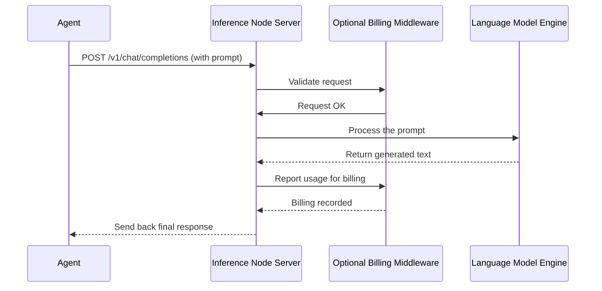

The `Agent` can decide _what_ to do, but it needs a powerful engine to actually perform the complex computations of a large language model.

This is where **AI Service Nodes** come in. They are the power plants of our AI ecosystem.

### The Problem: From Blueprint to Factory

Imagine you've designed a revolutionary new car. Your design (the `Agent`) is brilliant. It knows how the car should look, how the engine connects to the wheels, and how the steering works. But a blueprint can't drive. You need a factory with heavy machinery to actually build the car. And you might need different types of factories: one for assembling the car, one for testing its off-road capabilities on a special track, and another for training new assembly-line robots.

Our AI components are the same. The `Agent` is the blueprint. The AI Service Nodes are the specialized factories that bring the blueprint to life and offer its capabilities to the world. They are the runnable, deployable server applications that do the actual work.

### The Solution: Specialized AI Factories

In our project, we have three main types of Service Nodes, each a different kind of factory:

1.  **The Inference Node:** This is the main "chat factory." Its job is to run a powerful language model. When our `Agent` needs to think, reason, or generate text, it sends the request to an Inference Node. This is the node that provides the raw intelligence.

2.  **The Query Node:** This is the "private library" factory. It's a specialized server that provides Retrieval-Augmented Generation (RAG) capabilities. A user can give it their private documents and a question, and this node will search _only within those documents_ to find the answer. It's designed for secure, private data analysis.

3.  **The Training Node:** This is the "AI school." Its job is to take a general-purpose AI model and fine-tune it on a specific dataset. For example, you could use a Training Node to teach a base model to become an expert in legal documents or medical terminology.

These nodes are designed to be run as independent servers, exposing their functions over a standard API. This means any application, not just our `Agent`, can use their power.

### How to Run a Service Node

Running a service node is like turning on the power to one of our factories. You do it right from your command line. Let's look at how to start the most common one, the Inference Node.

To start an Inference Node, you run the `alith.inference.server` module and tell it which AI model to load.

```bash
# This command starts a server running a specific AI model
python3 -m alith.inference.server \
  --model /path/to/your/model.gguf \
  --port 8080
```

This command tells the project: "Start the inference server using the model file found at `/path/to/your/model.gguf`, and make it available on port `8080`."

Once running, you'll see output in your terminal indicating that a web server has started. Now, your `Agent` (or any other application) can be configured to send its requests to `http://localhost:8080` to get a response from the AI.

Similarly, you can start the other nodes:

```bash
# Start a Query Node to handle private data searches
python3 -m alith.query.server
```

```bash
# Start a Training Node to handle model fine-tuning jobs
python3 -m alith.training.server
```

Each command launches a dedicated server, ready to perform its specialized task.

### Under the Hood: A Web Server for AI

So what happens when you run one of these commands? You are starting a web server built using a popular Python framework called FastAPI. This server listens for incoming HTTP requests (just like any website) and, based on the request, performs an AI task.

Let's trace a typical request to an **Inference Node**.

1.  Our `Agent` needs to answer a user's question. It sends a request to the Inference Node's API endpoint (e.g., `/v1/chat/completions`).
2.  The Inference Node server receives this request.
3.  It might first pass the request through **Middleware**. Think of middleware as a security guard or a toll booth that inspects the request before it goes further. We'll see in the next chapter that this is where billing happens.
4.  The server passes the user's prompt to the loaded language model (the "engine").
5.  The model processes the prompt and generates a response.
6.  The server packages this response and sends it back to the `Agent`.

Here is a diagram of that flow:



### Diving into the Code

Let's peek inside [`alith/inference/server.py`](https://github.com/0xLazAI/alith/blob/main/sdks/python/alith/query/server.py) to see how this is structured. The code might look complex, but the core idea is simple.

The `if __name__ == "__main__":` block at the bottom is what runs when you execute the command from your terminal. It's responsible for parsing your command-line arguments, like `--model`.

```python
# Simplified from: alith/inference/server.py
if __name__ == "__main__":
    # Code to parse arguments like --host, --port, --model...
    parser = argparse.ArgumentParser(...)
    # ...
    args = parser.parse_args()

    # Call the main run function with the provided arguments
    run(
        host=args.host,
        port=args.port,
        model=args.model,
        settlement=args.settlement, # Important for later!
    )
```

This part just gathers the settings. The real work happens in the `run` function it calls.

The `run` function sets up and starts the web server. Notice the `if settlement:` check. This is a preview of how we can easily enable paid services.

```python
# Simplified from: alith/inference/server.py
def run(host: str, port: int, *, model: str, settlement: bool = False):

    # ... code to create the basic FastAPI web server app ...
    app = create_app(...)

    if settlement:
        # If settlement is enabled, add the billing "toll booth"
        from .settlement import TokenBillingMiddleware
        app.add_middleware(TokenBillingMiddleware)

    # Start the actual server
    return uvicorn.run(app, host=host, port=port)
```

This code shows the modular design. The core function is to create the `app`. Then, we can optionally `add_middleware` to it, adding new layers of functionality like billing without changing the core AI logic.

The Query Node ([`alith/query/server.py`](https://github.com/0xLazAI/alith/blob/main/sdks/python/alith/query/server.py)) works similarly. It defines an endpoint like `/query/rag` that uses a Store to search through private data and return the results.

---
