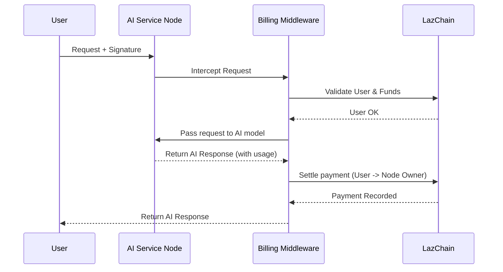

We learned how to run the "factories" that provide the computational power for our AI. These nodes are the workhorses of the network. But running powerful computers costs real money for electricity and hardware. So, how do the people running these nodes get paid for their services?

This is where the **Settlement & Billing Middleware** comes in. Think of it as the automated accounting system for the entire AI network.

### The Problem: A Free-for-All Isn't Sustainable

Imagine a highway system where there are no toll booths. Everyone can drive as much as they want for free. At first, it sounds great! But soon, the roads would be overcrowded, and there would be no money to pay for maintenance, repairs, or building new roads. The system would collapse.

Our AI network is like that highway. If using powerful AI Service Nodes is free, there is no incentive for people to provide the expensive computing resources needed to run them. We need a fair and automated way to charge for usage, like a smart toll booth that only charges for the distance you've driven.

### The Solution: A Smart Utility Meter for AI

The `Settlement & Billing Middleware` is our smart toll booth. It's a component that a node operator can "plug in" to their service node. This middleware sits between the user and the AI model, performing two critical jobs:

1.  **Authentication:** Before letting a request through, it checks the user's identity and confirms they have enough funds on the LazChain to pay for the service.
2.  **Billing:** After the AI model has done its work, the middleware measures the resources used (like the number of text "tokens" processed), calculates the cost, and automatically initiates the payment from the user to the node operator on the blockchain.

This middleware is the key to creating a decentralized marketplace for AI compute.

### How a Node Operator Enables Billing

Unlike the other components we've seen, you don't typically use this middleware in your `Agent` code. Instead, the person running the **AI Service Node** enables it when they start their server.

In the [Node](/hyperion/lazai/node) section, we saw this command to start a server:

```bash
# Start a server without billing
python3 -m alith.inference.server --model /path/to/model.gguf
```

To turn on the billing system, the node operator simply adds the `--settlement` flag.

```bash
# Start the same server, but now with the billing middleware enabled
python3 -m alith.inference.server \
  --model /path/to/model.gguf \
  --settlement
```

That's it! By adding that single argument, the server is now running our "smart toll booth," ready to authenticate users and charge for AI processing.

### Under the Hood: The Life of a Billed Request

When a user sends a request to a node with settlement enabled, a fascinating dance happens between the server and the blockchain.

1.  **User Signs the Request:** The user, using their wallet, creates a cryptographic signature that essentially says, "I, User A, approve this action and agree to pay for it." They send this signature along with their request.
2.  **Middleware Intercepts:** The `TokenBillingMiddleware` catches the incoming request _before_ it reaches the AI model.
3.  **Authentication & Validation:** The middleware checks the user's signature to prove their identity. It then makes a quick call to the LazChain to verify that the user's account is valid and has sufficient funds.
4.  **AI Processing:** If everything checks out, the request is passed along to the AI model, which generates a response.
5.  **Cost Calculation:** The middleware intercepts the outgoing response. It looks inside the response data to find out how much work was done (e.g., `"total_tokens": 512`).
6.  **Settlement:** It calculates the final cost (e.g., 512 tokens \* price per token) and submits this information to the LazChain to finalize the payment from the user to the node operator.
7.  **Final Response:** The original response from the AI model is sent back to the user.

Here is a diagram of that flow:



### Diving into the Code

Let's see how the code enables this. In the [`alith/inference/server.py`](https://github.com/0xLazAI/alith/blob/main/sdks/python/alith/inference/server.py) file, the `run` function checks for the `--settlement` flag we used.

```python
# Simplified from: alith/inference/server.py
def run(host: str, port: int, *, model: str, settlement: bool = False):

    app = create_app(...) # Create the basic web server

    if settlement:
        # If settlement is enabled, plug in the billing middleware
        from .settlement import TokenBillingMiddleware
        app.add_middleware(TokenBillingMiddleware)

    # Start the server
    uvicorn.run(app, host=host, port=port)
```

This shows the "plug-in" nature of the middleware. If `settlement` is true, we simply add the `TokenBillingMiddleware` to our server application (`app`).

Now, let's look at a simplified version of the middleware itself from [`alith/inference/settlement.py`](https://github.com/0xLazAI/alith/blob/main/sdks/python/alith/inference/settlement.py). Middleware classes have a special `dispatch` method that gets to inspect both the `request` and the `response`.

```python
# Simplified from: alith/inference/settlement.py

class TokenBillingMiddleware(BaseHTTPMiddleware):
    async def dispatch(self, request, call_next):
        # 1. First, validate the incoming request signature (not shown here for simplicity)
        # from ..lazai.request import validate_request
        # validate_request(request, ...)

        # 2. Let the request proceed to the AI model
        response = await call_next(request)

        # 3. After the AI is done, inspect the response to bill the user
        if response.status_code == 200:
            # ... code to read the response body and get the token count ...
            response_data = json.loads(response_body)
            total_tokens = response_data["usage"]["total_tokens"]

            # 4. Calculate the cost and settle the payment on the blockchain
            calculate_billing(request, total_tokens, self.client)

        return response
```

This code follows our diagram perfectly. It lets the main application do its job by calling `await call_next(request)`, and then it does its own accounting work afterward.

The final piece of the puzzle is the `calculate_billing` function.

```python
# Simplified from: alith/inference/settlement.py

def calculate_billing(request, total_tokens, price_per_token, client):
    # Get user info from the request headers
    user = request.headers[USER_HEADER]
    nonce = request.headers[NONCE_HEADER]
    # ...

    # Calculate the final cost
    cost = total_tokens * price_per_token

    # Tell the client to settle the fees on the blockchain
    client.inference_settlement_fees(...)
    return user, cost
```

This function does the simple math and then, most importantly, calls a method on the `client` object. This `client` is our bridge to the blockchain.
