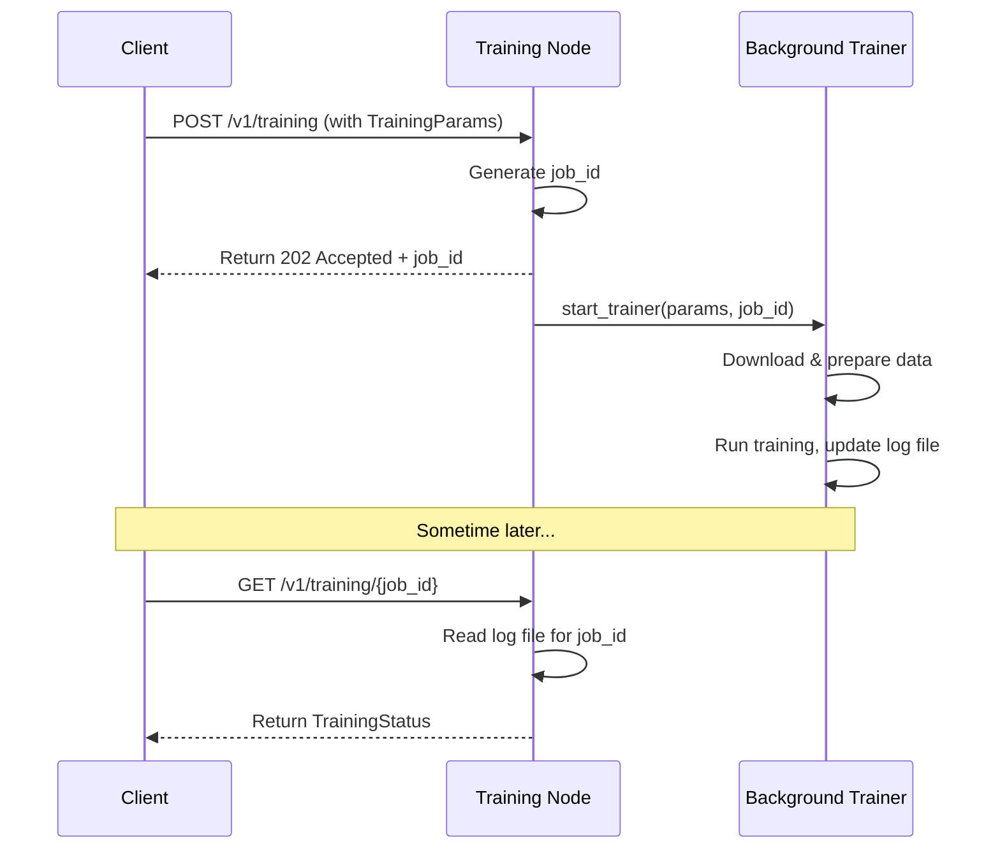

Now, we'll tackle one of the most exciting capabilities: creating our own specialized AI models. A general-purpose model is a jack-of-all-trades, but what if you need a master of one?

This is where the **Training Pipeline** comes in. It is a specialized "university" for language models.

### The Problem: A Generalist in a Specialist's World

Imagine you have a powerful, general AI that knows about history, science, and art. Now, you want to use it to provide expert-level customer support for your new software product. If a user asks, "How do I configure the Z-widget in version 3.2?", the general AI has no idea. It wasn't trained on your product's documentation.

We need a way to take this smart, general model and send it to "school" to learn a new, specific subject. We need to turn our generalist into a specialist.

### The Solution: An AI University

The Training Pipeline is the infrastructure for this AI university. It allows you to fine-tune a general-purpose model on your own private data, turning it into an expert on a particular topic.

You play the role of the university's dean. You provide:

- **The Curriculum:** A dataset of examples you want the model to learn from (e.g., your product's help documents or past support tickets).
- **The Teaching Method:** A set of training parameters that define _how_ the model should learn.

The pipeline then manages the entire, resource-intensive training process, from preparing the data to running the "classes" on powerful GPUs, ultimately graduating a new, customized model.

### How to Use the Training Pipeline

Using the training pipeline is a three-step process:

1.  Start a **Training Node**, the server that runs the university.
2.  Define your curriculum and teaching method (`TrainingParams`).
3.  Submit your training job and monitor its progress.

#### Step 1: Start the Training Node

First, the person providing the computing power needs to start a Training Node. This is done from the command line, just like our other service nodes.

```bash
# This command starts the "AI University" server
python3 -m alith.training.server --port 8080
```

This starts a server listening on port `8080`, ready to accept new training jobs.

#### Step 2: Define the "Curriculum" and "Teaching Method"

Now, as a user, you need to define your training job. We do this by creating a set of `TrainingParams`. Let's say we want to teach a small model to be an expert on our product. We'll use a technique called **LoRA**, which is a very efficient way to fine-tune a model.

The parameters are defined using Pydantic models from [`alith/training/types.py`](https://github.com/0xLazAI/alith/blob/main/sdks/python/alith/training/types.py). Let's create our parameters in Python.

```python
# Import the parameter classes
from alith.training.types import TrainingParams, LoraParams, DataParams

# 1. Define the "curriculum" - our private data
# (For a real job, this URL would point to your training data file)
our_curriculum = DataParams(data_url="https://example.com/my_product_docs.jsonl")

# 2. Define the "teaching method" using LoRA
our_teaching_method = TrainingParams(
    model="Qwen/Qwen2-0.5B",       # Start with this general model
    finetuning_type="lora",        # Use the efficient LoRA method
    num_epochs=3,                  # Have the model study the data 3 times
    learning_rate=5e-5,            # How big of a "step" to take after each lesson
    data_params=our_curriculum,    # Link to our curriculum
    lora_params=LoraParams(rank=8) # LoRA-specific settings
)
```

This configuration tells the pipeline: "Take the `Qwen2-0.5B` model and fine-tune it using the `lora` method for `3` epochs on the data found at my URL." There are many more parameters you can tweak, but these are the most important ones to start with.

#### Step 3: Submit and Monitor the Job

Training can take hours or even days, so we don't wait for it to finish. We submit it as a background job. We'll use the `requests` library to send our `TrainingParams` to the running Training Node.

```python
import requests
import json
import time

# Convert our Pydantic object to a dictionary for sending
job_config = our_teaching_method.model_dump()

# Send the job to the server
response = requests.post(
    "http://localhost:8080/v1/training",
    json=job_config
)

# The server immediately responds with a job ID
job_result = response.json()
job_id = job_result['job_id']

print(f"Training job started successfully! Your job ID is: {job_id}")
```

**Output:**

```
Training job started successfully! Your job ID is: a1b2c3d4
```

Now the training is running in the background! We can use our `job_id` to check on its progress at any time.

```python
# Check the status of our job
status_response = requests.get(f"http://localhost:8080/v1/training/{job_id}")
status = status_response.json()

print(f"Job Status: {status['percentage']}% complete.")
print(f"Current Loss: {status['loss']}") # A lower loss value is better!
```

**Output:**

```
Job Status: 15.0% complete.
Current Loss: 1.234
```

You can call this status endpoint periodically until the `percentage` reaches 100. Once finished, a new model, fine-tuned on your data, will be saved in the node's output directory.

### Under the Hood: The Life of a Training Job

When you submit a training job, a carefully orchestrated process begins.

1.  **Job Submission:** Your client sends an HTTP POST request to the `/v1/training` endpoint on the Training Node. The body of the request contains your `TrainingParams`.
2.  **Validation & ID Generation:** The server receives the request. It quickly validates the parameters and generates a unique `job_id` (e.g., `a1b2c3d4`).
3.  **Immediate Response:** The server immediately sends a `202 Accepted` response back to you, containing the `job_id`. This non-blocking design is crucial because the actual training will take a long time.
4.  **Background Task:** The server adds the real training work to a background task queue. This is where the heavy lifting happens.
5.  **Data Preparation:** The background trainer downloads your data from the `data_url`, decrypts it if necessary, and prepares it for the model.
6.  **Model Training:** The trainer loads the base model and starts the fine-tuning process using your specified parameters. It periodically writes its progress (percentage, loss, etc.) to a log file associated with the `job_id`.
7.  **Status Check:** When you make a GET request to `/v1/training/{job_id}`, the server simply reads the latest entry from that specific log file and returns it to you.



### Diving into the Code

The logic is split across a few key files in [`alith/training/`](https://github.com/0xLazAI/alith/blob/main/sdks/python/alith/training/).

First, [`alith/training/server.py`](https://github.com/0xLazAI/alith/blob/main/sdks/python/alith/training/server.py) starts the web server. This is the entry point that listens for your requests.

```python
# Simplified from: alith/training/server.py
def run(host: str, port: int):
    app = FastAPI()
    # ... middleware setup ...

    # The router contains our API endpoints like /v1/training
    app.include_router(router, prefix="/v1/training", ...)

    # Start the server
    uvicorn.run(app, host=host, port=port)
```

Next, [`alith/training/service.py`](https://github.com/0xLazAI/alith/blob/main/sdks/python/alith/training/service.py) defines the API endpoints. The `training` function handles new job submissions. Notice `BackgroundTasks`—this is FastAPI's way of running long jobs without blocking the server.

```python
# Simplified from: alith/training/service.py
@router.post("")
async def training(params: TrainingParams, tasks: BackgroundTasks) -> TrainingResult:
    # ... validate request ...
    job_id = generate_job_id()

    # Add the real work to a background task queue
    tasks.add_task(
        start_trainer,
        params=params,
        job_id=job_id,
    )

    # Immediately return the job ID
    return TrainingResult(job_id=job_id, ...)
```

Finally, [`alith/training/trainer.py`](https://github.com/0xLazAI/alith/blob/main/sdks/python/alith/training/trainer.py) contains the `start_trainer` function. This is where the _actual_ training happens. It's a wrapper that calls `run_exp` from `llama-factory`, a powerful open-source library specialized for fine-tuning models.

```python
# Simplified from: alith/training/trainer.py
from llamafactory.train.tuner import run_exp

def start_trainer(params: TrainingParams, job_id: str):
    """Here we use the llamafactory to train the model"""

    # 1. Prepare the data (download, decrypt, etc.)
    dataset_name = preprocess_data(params)

    # 2. Build a large dictionary of arguments for llama-factory
    training_args = {
        "do_train": True,
        "model_name_or_path": params.model,
        "finetuning_type": params.finetuning_type,
        "dataset": dataset_name,
        "output_dir": get_output_dir(job_id),
        # ... and many more parameters from our TrainingParams ...
    }

    # 3. Call the specialized library to do the heavy lifting
    run_exp(training_args)
```

This shows a smart design: our project provides a user-friendly API and pipeline for managing jobs, while delegating the complex, low-level training algorithms to a specialized, best-in-class library.
