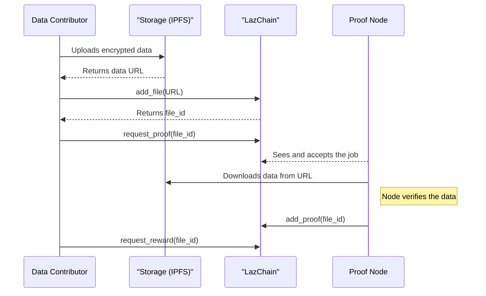

In the previous section, we learned how to be a _consumer_ in the LazAI economy, securely using AI models run by others. But a healthy economy needs producers too! What if you have a valuable dataset—like curated medical images, financial records, or specialized texts—that could help train better AI models? How can you contribute it to the network, prove its quality, and get rewarded for your effort?

### Your Data, Verified: The "Peer Review" for AI Datasets

Think of contributing data to the LazAI network like submitting a scientific paper to a prestigious journal for peer review. You don't just email your paper to a random person; you follow a structured, verifiable process to build trust.

1.  **Write the Paper (Prepare Your Data):** You prepare your dataset. For sensitive information, you might encrypt it to protect privacy.
2.  **Submit to a Journal (Publish its Location):** You upload your data to a public storage system (like IPFS) and then register its _location_ on LazChain. You are not putting the data itself on the chain, just a pointer to it.
3.  **Request Peer Review (Request a Proof):** You ask the network for a "proof," which is like asking the journal to send your paper to expert reviewers. A network "node" (a reviewer) is assigned to verify your data.
4.  **Get Published (Receive a Proof):** The node examines your data and, if it meets the criteria, submits a "proof" to LazChain. This is like your paper being officially accepted and published. Your data is now trusted.
5.  **Earn Citations (Get Rewarded):** With your data proven and trusted, others can use it, and you can earn rewards for your valuable contribution.

Our goal is to walk through this entire "peer review" process to contribute a piece of data to the LazAI network.

### The Contribution Workflow: Step-by-Step

Let's follow the journey of a data contributor, referencing the logic found in files like [`lazai_data_contribution_with_reward.py`](https://github.com/0xLazAI/alith/blob/main/sdks/python/examples/lazai_data_contribution_with_reward.py). We'll simplify the steps to focus on the core concepts.

#### Step 1: Prepare Your Data (and Encrypt It)

First, we prepare our data. If it's sensitive, we should encrypt it. LazAI has built-in tools for this. Let's say our valuable data is a secret message.

We'll use a password to encrypt it. In a real application, you'd generate this password securely, as shown in the examples.

```python
from alith.data import encrypt

# This is our valuable, private dataset
privacy_data = b"The future of AI is decentralized."

# We create a password to lock the data
password = "my-secret-password-123"

# Encrypt the data, so only someone with the password can read it
encrypted_data = encrypt(privacy_data, password)

print("Data has been encrypted!")
```

Now our `encrypted_data` is a bundle of scrambled text that is safe to share publicly. We keep the `password` secret.

#### Step 2: Put the Data Online and Register It

Next, we need to upload our `encrypted_data` to a public storage service like IPFS (InterPlanetary File System). After uploading, we get a unique URL.

Then, we use our LazAI Client to register this URL on LazChain. This creates a permanent, public record pointing to our data.

```python
from alith.lazai import Client

client = Client()

# Imagine we uploaded our data and got this URL from IPFS
# (This is just a placeholder)
url = "ipfs://QmXo9bb4cZJ..."

# Register the URL on LazChain
file_id = client.add_file(url)

print(f"Success! Our file is registered with ID: {file_id}")
```

Our data's existence is now known to the network, but it's not yet trusted or verified.

#### Step 3: Request a Proof (The "Peer Review")

Now, we ask the network to verify our contribution. We offer a small fee to a "proof node" to do the work.

```python
# Offer a small fee for the node's verification service
node_fee = 10

# Broadcast a request for a proof to the network
client.request_proof(file_id, node_fee)

print(f"Proof has been requested for file {file_id}. A node will now review it.")
```

This action creates a "job" on the network that any available proof node can accept.

#### Step 4: A Node Verifies and Submits the Proof

This step happens on a different machine—the proof node's machine.

1.  A node sees our job request on the blockchain.
2.  It accepts the job.
3.  It downloads the `encrypted_data` from the IPFS URL we provided.
4.  It performs verification checks (e.g., checks for viruses, validates format, etc.). If the data is encrypted, we would securely provide the node with the password.
5.  If everything looks good, the node submits a "proof" back to the blockchain, confirming the data is valid. This is done by the node calling a function like `node.add_proof()`.

#### Step 5: Claim Your Reward

Once the proof is on the blockchain, our data is officially "peer-reviewed" and trusted. We can now claim our reward for contributing high-quality data to the ecosystem.

```python
# After the node has submitted the proof, we can request our reward
client.request_reward(file_id)

print(f"Reward requested for our contribution of file {file_id}!")
```

This final transaction rewards us for our work, completing the cycle and incentivizing more high-quality contributions.

### How It Works Under the Hood

The process is a coordinated effort between you (the Contributor), LazChain, and a Proof Node.

1.  **You Prepare:** You get your data ready, encrypt it, and upload it to a place like IPFS.
2.  **You Register:** You call `client.add_file(url)`, which creates a transaction on the blockchain, establishing you as the owner of the data at that URL.
3.  **You Request:** You call `client.request_proof(file_id)`, which creates another transaction that announces a "job" is available for nodes.
4.  **Node Accepts & Verifies:** A proof node, which is constantly watching the blockchain, sees the job. It accepts it, downloads the data, and performs its verification process.
5.  **Node Proves:** After successful verification, the node calls `node.add_proof()`, sending a final transaction to the blockchain that attaches a "verified" stamp to your `file_id`.
6.  **You Get Rewarded:** You call `client.request_reward(file_id)` which triggers the reward mechanism in the smart contract.

Here is a diagram of the key interactions:



The example file [`lazai_data_contribution_with_reward.py`](https://github.com/0xLazAI/alith/blob/main/sdks/python/examples/lazai_data_contribution_with_reward.py) shows this entire flow in a single, automated script. It handles creating a password from your wallet's signature, uploading to IPFS, and communicating with the node to complete the proof request.
