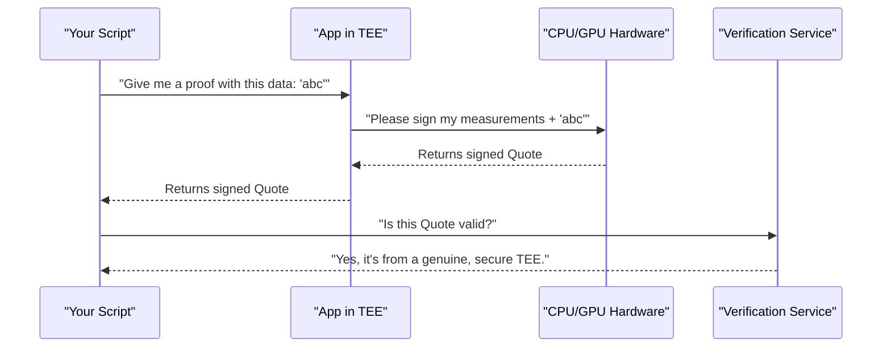

In the previous section, we learned how to contribute data to the LazAI network and have it verified by a "proof node." This system works great, but it relies on us trusting the proof node operator not to misuse our data during verification. What if our data is extremely sensitive, like a user's private key or private medical information? How can we let a node process our data without _ever_ revealing it to the node operator?

### The "Secure Black Box" for Computation

A Trusted Execution Environment (TEE) is a special, isolated area inside a computer's processor. Think of it as a **secure digital vault** or a **black box**.

- Anything that goes inside the box (code and data) is encrypted and protected.
- The code running inside the box can work with the unencrypted data.
- Crucially, _no one_ from the outside can peek inside—not even the owner of the computer, the operating system, or any other program.

This technology allows us to send our most private data to a remote machine, have it processed securely inside this "black box," and get a result back, all with a mathematical guarantee that our data was never exposed.

Our goal for this chapter is to understand how to use Alith's clients to talk to these TEEs and get a cryptographic "receipt" (an attestation) proving that our application is running securely and untampered inside one.

### What is Attestation? A Digital Notary Stamp

How can we trust that a remote computer _really_ has a TEE and that it's running the exact code we expect? We need proof. This proof is called an **attestation**.

Getting an attestation is like asking the TEE for a notarized statement that says:

> "I, a genuine and secure chip, do hereby certify that I am currently running the application with the code measurement `[a unique hash]`, and I have not been tampered with. Signed, The CPU/GPU."

This "notary stamp" is a cryptographic signature from the chip manufacturer itself, which is impossible to forge. Alith provides simple clients to request these attestations from different TEE providers like Phala and Marlin.

### Interacting with a Phala TEE

The Phala network uses TEEs to enable private computation. Alith's `TappdClient` is our tool for communicating with a Phala TEE application.

Let's see how we can get proof that a Phala TEE app is running securely.

**1. Import and Create the Client**

First, we import the `TappdClient` and create an instance. This client connects to the TEE running on the machine.

```python
from alith.tee.phala import TappdClient

# Connect to the local Phala TEE service
client = TappdClient()
```

This simple line establishes a connection to the secure environment.

**2. Get Basic Info from the TEE**

We can start by asking the TEE for its basic identity information. This is like asking the black box for its ID card.

```python
# Get information about the TEE application
info = client.info()
print("TEE Application ID:", info.app_id)
```

This tells us which specific application is running inside the secure environment.

**3. Request a Signed Attestation (The "Quote")**

Now for the most important part: asking for the cryptographic proof. We use the `tdx_quote()` method. We can also include some of our own data (`report_data`) to be included in the signed proof.

```python
# Request a signed proof, including some of our own data
quote_result = client.tdx_quote(report_data="my-verification-request-123")

print("Attestation Quote:", quote_result.quote[:32], "...")
```

**Example Output:**

```
Attestation Quote: 4a8b2f91c3d0e5a67b8c9d0e1f2a3b4c ...
```

This long string of characters is our unforgeable "notary stamp." We can now send this quote to a verification service to confirm that it's a genuine proof from a real TEE running our exact code.

### Interacting with a Marlin TEE

The Marlin ecosystem also uses TEEs for its services. The process is very similar, but we use the `MarlinClient`.

**1. Import and Create the Client**

Just like before, we start by creating a client.

```python
from alith.tee.marlin import MarlinClient, AttestationRequest

# Initialize a client for the Marlin TEE service
client = MarlinClient.default()
```

**2. Prepare and Send an Attestation Request**

With Marlin, we package our request into an `AttestationRequest` object. This includes our public key and any other data we want to be part of the proof.

```python
# Create a request for attestation
request = AttestationRequest(
    public_key=b"my_public_key",
    user_data=b"my_other_data",
    nonce=b"a_random_value_123",
)
```

This bundles all the information we want the TEE to sign.

**3. Get the Attestation**

Finally, we send the request and get back the attestation result.

```python
# Fetch the signed attestation from the TEE
result = client.attestation_hex(request)

print(f"Attestation result: {result[:32]}...")
```

Again, we receive a cryptographic proof that we can independently verify, confirming the integrity of the remote application.

### How Does It Work Under the Hood?

The magic of attestation involves a secure conversation between your script, the application inside the TEE, and the computer's CPU/GPU hardware itself.

1.  **You Make a Request:** Your script calls `client.tdx_quote()`.
2.  **Challenge is Sent:** The client sends your request (including any `report_data`) to the application running inside the TEE.
3.  **TEE Prepares Report:** The TEE application gathers its security measurements (hashes of its code and memory) and combines them with your `report_data`.
4.  **CPU/GPU Creates Quote:** The application passes this report to a special, locked-down part of the CPU/GPU. The CPU/GPU signs the report using a secret cryptographic key that was burned into the silicon during manufacturing. This signed report is the "quote."
5.  **Quote is Returned:** The quote is sent back out of the TEE and returned to your script.
6.  **You Verify:** You can now take this quote and have it verified. The verification process confirms that the signature came from a genuine CPU and that the security measurements match the application you intended to run.

Here is a diagram of the simplified flow:



The code in [`agent_with_phala_tee.py`](https://github.com/0xLazAI/alith/blob/main/sdks/python/examples/agent_with_phala_tee.py) and [`agent_with_marlin_tee.py`](https://github.com/0xLazAI/alith/blob/main/sdks/python/examples/agent_with_marlin_tee.py) demonstrates how these client libraries act as the bridge in this process, hiding all the complex cryptographic steps behind simple function calls.
