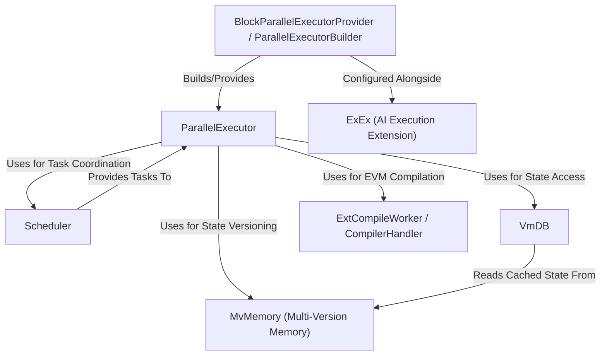

## Key Features of Metis SDK

- **Modular Architecture**: Metis SDK is an open-source modular framework designed to provide Web3 developers with a powerful foundation for innovation. It provides plugin features, you can choose according to your needs.
- **High Performance**: Leverages MetisVM, MetisDB and parallel execution technologies to deliver low-latency, high-throughput on-chain operations.
- **Strong Compatibility**: Seamlessly integrates with the Ethereum ecosystem, supporting Solidity smart contracts while simplifying DApp migration.
- **Scalable Consensus Engine**: Supports customizable Sequencer networks, which can be either decentralized or centralized, depending on the specific use case.
- **Decentralized Sequencer**: For Layer 2, the Metis Sequencer Network consists of multiple decentralized sequencers, each responsible for transaction ordering, validation, and state commitment.
- **Flexible Deployment**: Supports Layer 1, Layer 2, and Layer 3 network configurations, tailored to diverse application needs.
- **AI Features Support**: Use [LazAI](https://lazai.network) and [Alith](https://github.com/0xLazAI/alith) to provide AI related on-chain or off-chain tasks including data processing, model inference, fine tuning, etc.

The Metis SDK provides a **parallel execution engine** for the *Reth* blockchain node.
Instead of processing transactions one by one, it uses multiple CPU cores to execute them *concurrently*, aiming to significantly **speed up block processing**.
It manages shared data carefully using a *multi-version memory system* and coordinates tasks with a *scheduler*.
It can optionally use *JIT/AOT compilation* to further accelerate smart contract execution and allows integrating custom extensions like an *AI service*.

**Source Repository:** [https://github.com/MetisProtocol/metis-sdk](https://github.com/MetisProtocol/metis-sdk)

## Chapters

1. [BlockParallelExecutorProvider / ParallelExecutorBuilder
](01_blockparallelexecutorprovider___parallelexecutorbuilder_.md)
2. [ParallelExecutor
](02_parallelexecutor_.md)
3. [Scheduler
](03_scheduler_.md)
4. [MvMemory (Multi-Version Memory)
](04_mvmemory__multi_version_memory__.md)
5. [VmDB
](05_vmdb_.md)
6. [ExtCompileWorker / CompilerHandler
](06_extcompileworker___compilerhandler_.md)
7. [ExEx (AI Execution Extension)
](07_exex__ai_execution_extension__.md)

---

Generated by [AI Codebase Knowledge Builder](https://github.com/The-Pocket/Tutorial-Codebase-Knowledge)