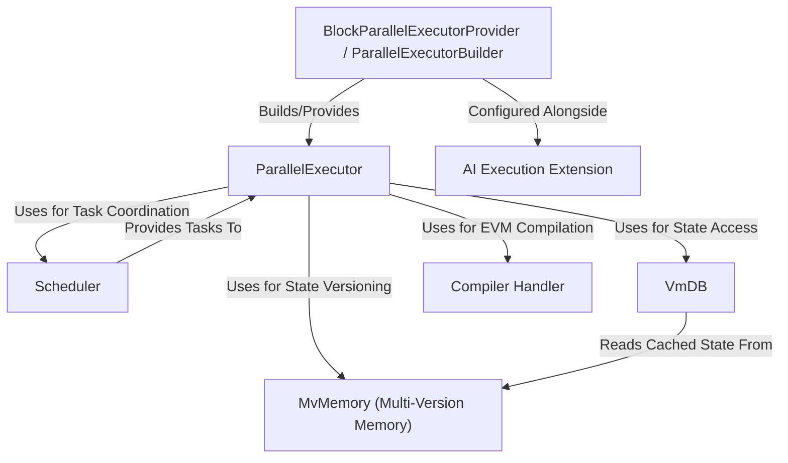

This project provides a **parallel execution engine** for the *Reth* blockchain node.
Instead of processing transactions one by one, it uses multiple CPU cores to execute them *concurrently*, aiming to significantly **speed up block processing**.
It manages shared data carefully using a *multi-version memory system* and coordinates tasks with a *scheduler*.
It can optionally use *JIT/AOT compilation* to further accelerate smart contract execution and allows integrating custom extensions like an *AI service*.

**Source Repository:** [https://github.com/MetisProtocol/metis-sdk](https://github.com/MetisProtocol/metis-sdk)

## Sections

1. [Parallel Executor Builder
](metis-sdk/parallel-executor-builder)
2. [ParallelExecutor
](metis-sdk/parallel-executor)
3. [Scheduler
](metis-sdk/scheduler)
4. [Multi-Version Memory
](metis-sdk/multi-version-memory)
5. [VmDB
](metis-sdk/vmdb)
6. [Compiler Handler
](metis-sdk/compiler-handler)
7. [AI Execution Extension
](metis-sdk/ai-execution-extension)